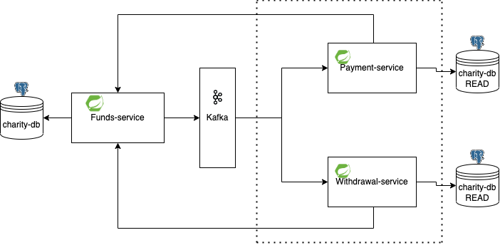

# Charity Application

Charity application allows you to manage collections made available in a given environment. The main purpose is to enable users to contribute to a fundraiser and to pay out funds to fundraising owners. The user also has the option of displaying information about the fundraising campaign along with a summary of payments and withdrawals.

## Stages
- Creation of the system architecture with synchronous communication between the funds-service and withdrawal-service
- Implementation of Apache Kafka for communication between services, creation of payment-service as a mock of external payment provider.

## Run

Use a gradle wrapper for run the system

```bash
./gradlew bootRun
```

## Testing
Make sure that Docker is installed on your computer.
```
./gradlew test
```
In case of missing docker images, please visit my hub or pull bdziadosz96/withdrawalservice and bdziadosz96/paymentservice

## Data
For database supply with sample data, use prepared calls in ./api/

## Contributing
Pull requests are welcome. For major changes, please open an issue first to discuss what you would like to change or just message me via email.
```
bartlomiej.dziadosz96@gmail.com
```

## Architecture


Please make sure to update tests as appropriate.

